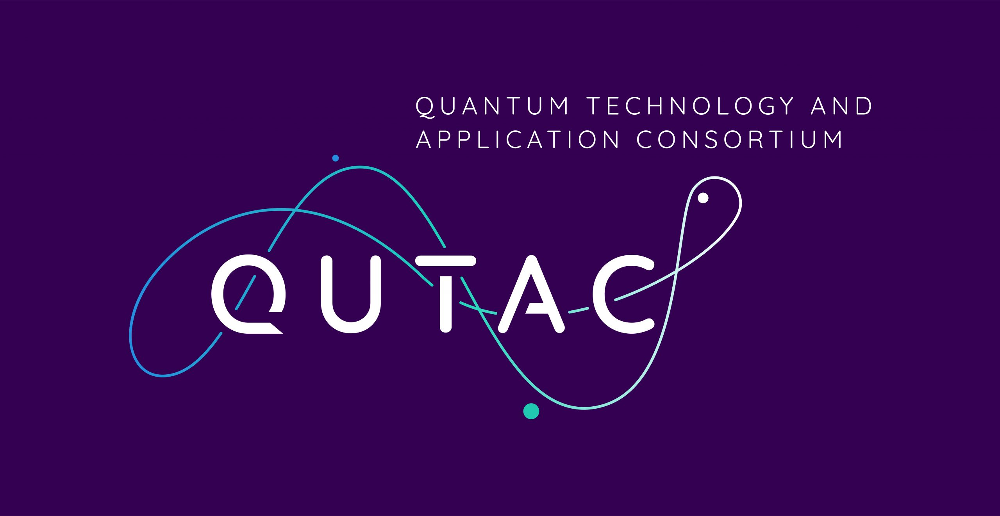

Credit 
======================================================================
 This project was developed within the `Quantum Technology & Application Consortium (QUTAC) <https://www.qutac.de/>`_ 

 

The core contributers to the project are: 

  .. list-table:: 
   :widths: 25 50
   :header-rows: 1

   * - Name
     - Company
   * - Aleksandar Vučković
     - Merck KGaA (Darmstadt, Germany)
   * - Oliver Mitevski
     - Munich Re
   * - Carlos A. Riofrío
     - BMW Group
   * - Caitlin Jones
     - BASF Digital Solutions GmbH
   * - Florian Krellner
     - SAP SE
   * - Pallavi Bhardwaj
     - SAP SE

 Other contributers to this project are: 

 .. list-table:: 
   :widths: 25 50
   :header-rows: 1

   * - Name
     - Company
   * - Joseph Doetsch
     - Lufthansa Industry Solutions AS GmbH
   * - Johannes Klepsch
     - BMW Group
   * - Thomas Ehmer
     - Merck KGaA (Darmstadt, Germany)
   * - Andre Luckow
     - BMW Group

License
======================================================================
Copyright 2023 QUTAC, BASF Digital Solutions GmbH, BMW Group, 
Lufthansa Industry Solutions AS GmbH, Merck KGaA (Darmstadt, Germany), 
Munich Re, SAP SE.

Licensed under the Apache License, Version 2.0 (the "License");
you may not use this file except in compliance with the License.
You may obtain a copy of the License at

    http://www.apache.org/licenses/LICENSE-2.0

Unless required by applicable law or agreed to in writing, software
distributed under the License is distributed on an "AS IS" BASIS,
WITHOUT WARRANTIES OR CONDITIONS OF ANY KIND, either express or implied.
See the License for the specific language governing permissions and
limitations under the License.

